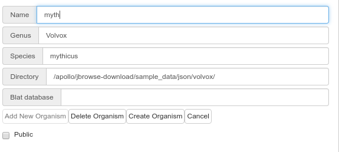

# Apollo


[](https://zenodo.org/badge/latestdoi/58064464)


> Apollo is a browser-based tool for visualisation and editing of sequence
> annotations. It is designed for distributed community annotation efforts,
> where numerous people may be working on the same sequences in geographically
> different locations; real-time updating keeps all users in sync during the
> editing process.

## Running the Container

The container is publicly available as `gmod/apollo:stable`. The recommended
method for launching the container is via docker-compose due to a dependency on
a postgres image.

There are a large number of environment variables that can be adjusted to suit
your site's needs. These can be seen in the
[apollo-config.groovy](https://github.com/GMOD/Apollo/blob/master/sample-docker-apollo-config.groovy)
file.

## Quickstart

This procedure starts tomcat in a standard virtualized environment with a PostgreSQL database with [Chado](http://gmod.org/wiki/Introduction_to_Chado).

Install [docker](https://docs.docker.com/engine/installation/) for your system if not previously done.

Choose an option:

- To test a versioned release to test installation: `docker run -it -p 8888:8080 gmod/apollo:2.0.6` 

- Install a latest release to test installation: `docker run -it -p 8888:8080 gmod/apollo:latest` 
  -  To make sure you have the latest pull with ```docker pull gmod/apollo``` to fetch newer versions
  
- If using within a larger context (e.g., as part of a docker-compose script) you can run an ```apollo-only``` branch provides only apollo + tomcat (no PostgreSQL):  
  - `docker run -it -p 8888:8080 gmod/apollo:apollo-only` 
  
- To run in production against JBrowse data and a persistent database (you can create an empty directory called `postgres-data`):  
    - `docker run -it -v /jbrowse/root/directory/:/data -v postgres-data:/var/lib/postgresql -p 8888:8080 gmod/apollo:latest`

- You can run production using the build created by quay.io instead (https://quay.io/repository/gmod/docker-apollo):
    - `docker run -it -v /jbrowse/root/directory/:/data -v postgres-data:/var/lib/postgresql  -p 8888:8080 quay.io/gmod/docker-apollo:latest`
    
In all cases, Apollo will be available at [http://localhost:8888/](http://localhost:8888/) (or 8888 if you don't configure the port)

When you use the above mount directory ```/jbrowse/root/directory``` and your genome is in 
```/jbrowse/root/directory/myawesomegenome``` you'll point to the directory: ```/data/myawesomegenome```.

NOTE: If you don't use a locally mounted PostgreSQL database (e.g., creating an empty directory and mounting using `-v postgres-data:/var/lib/postgresql`)
or [set appropriate environment variables](https://docs.docker.com/engine/reference/commandline/run/) for a remote database 
( see variables [defined here](https://github.com/GMOD/docker-apollo/blob/master/launch.sh)) your annotations and setup will not be persisted.

### Logging In

The default credentials in this image are:

| Credentials |                    |
| ---         | ------------------ |
| Username    | `admin@local.host` |
| Password    | `password`         |


### Loading Data

Some sample data is baked into the container for you to play around with:



### Chado

Chado support is now baked into the GMOD docker container image.
